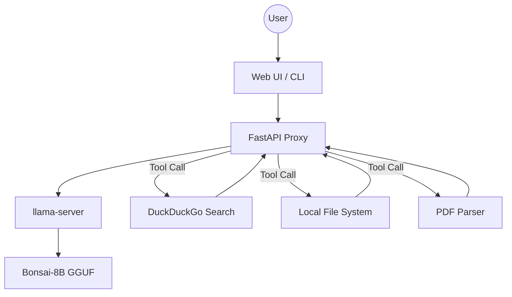

# ROBIT Technical Documentation
## Max Performance AI Research Engine

ROBIT is a high-performance, local-first AI research and coding agent designed for maximum efficiency on consumer hardware. This document outlines the technical architecture, performance optimizations, and core components of the system.

---

## 1. System Architecture

ROBIT follows a modular architecture that separates the UI, the Logic Proxy, and the Inference Engine.

### Core Components:
-   **Frontend (HTML5/Vanilla JS/CSS3)**: A responsive, dark-mode glassmorphism interface. It handles Markdown rendering, live code previews (IFRAME sandboxing), and the recursive agent UI flow.
-   **Backend Proxy (Python/FastAPI)**: Acts as an orchestrator. It manages the lifecycle of the LLM engine, executes "Agentic Tools" (Search, FS Access), and streams responses with minimal overhead.
-   **Inference Engine (llama-server)**: The backbone of the system, powered by `llama.cpp`. It runs GGUF models and is automatically optimized for the detected hardware.

---

## 2. The 5 Performance Layers (L1-L5)

ROBIT is engineered for speed, specifically tuned for **1-Bit and Extremely Low Quantization** models like Bonsai 8B.

### Layer 1: Fine-tuned Engine Parameters
We bypass generic defaults. ROBIT utilizes:
-   **`--ubatch` (Micro-batching)**: Configured to 512 for reduced prompt-processing latency.
-   **`--mmap`**: Memory mapping for near-instant model loading.
-   **`Flash-Attention`**: Enabled by default to optimize KV-cache throughput.

### Layer 2: N-Gram Speculative Decoding
For CPU-only mode, ROBIT implements a **Draftless Speculative Decoding** approach using N-Grams.
-   **Mechanism**: The engine predicts the next few tokens based on previous sequences without requiring a second "draft" model.
-   **Benefit**: Increases tokens-per-second (t/s) by up to 1.5x on standard CPUs.

### Layer 3: OS-Level Optimization
ROBIT interacts directly with the Operating System to claim resources:
-   **Process Priority**: Automatically sets the `llama-server` process to **HIGH priority** on Windows.
-   **CPU Affinity**: Pins the engine to physical cores (avoiding hyperthreading confusion) to minimize context-switching overhead.

### Layer 4: KV Cache Pre-warming
Standard LLM engines are slow on the "First Token" because they must process the system prompt.
-   **Innovation**: On startup, ROBIT sends a silent "dummy" request. This primes the KV cache with the System Prompt, ensuring that the first user message responds **3-8 seconds faster**.

### Layer 5: Low-Latency Streaming
The streaming buffer is throttled to yield chunks immediately to the frontend. This eliminates the "wait-then-burst" feeling common in other local LLM wrappers.

---

## 3. Hardware Abstraction (Multi-Backend)

ROBIT selects the optimal binary path based on your `.env` configuration:

| Path | Backend | Target Hardware |
| :--- | :--- | :--- |
| `bin/` | **PrismML** | High-speed 1-bit CPU inference (AVX2). |
| `bin-cuda/` | **CUDA** | NVIDIA RTX/GTX GPUs. |
| `bin-vulkan/` | **Vulkan** | AMD Radeon, Intel Arc, and Universal GPU support. |
| `bin-metal/` | **Metal** | Apple Silicon (M1/M2/M3). |

---

## 4. Agentic Tool Specifications

ROBIT uses an XML-tagging system for tool calling. The Proxy server intercepts these tags and injects the results back into the conversation.

### Supported Tools:
1.  **Search**: `<search query="topic" />` (Uses DuckDuckGo)
2.  **Read**: `<read path="file.txt" />` (Supports PDF and Source Code)
3.  **Write**: `<write path="file.js">content</write>` (Directly saves to disk)
4.  **List**: `<ls path="./dir" />` (Lists directory contents)

---

## 5. Security & Isolation
-   **Context Truncation**: Files are automatically truncated to 15,000 characters to prevent context-window overflow.
-   **Sandboxing**: Code previews in the UI run inside a sandboxed `<iframe>` with `allow-scripts` but limited cross-origin permissions.

---
© 2026 **Rogatekno Labs** - Developed by **Ridwan Mubarok**
